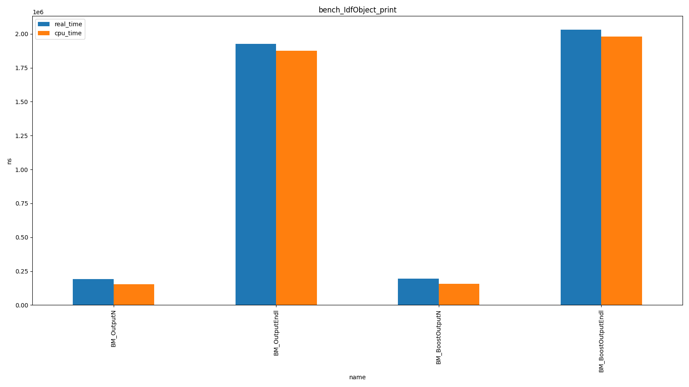
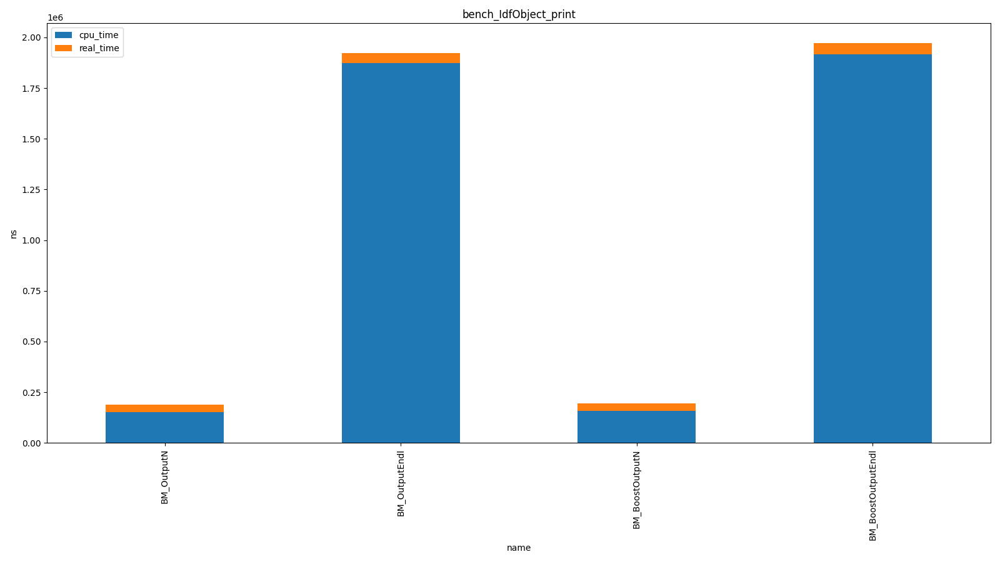

# CppBenchmarks

A collection of some benchmark scripts I used for C++.

The `CMakeLists.txt` will add some [conan](https://github.com/conan-io/conan) dependencies (such as [Google Benchmark library](https://github.com/google/benchmark)), and do some other magic (enable ccache, etc).

Tested with:

* GCC 10.1.0
* cmake 3.19.2
* conan 1.32.1

One executable will be made for each cpp file that starts with `bench`: `bench_<name>.cpp` will create a `build/Products/<name>` executable.

As usual, you can pass options to the executable:

```shell
mkdir build/
cd build/
cmake -G Ninja -DCMAKE_EXPORT_COMPILE_COMMANDS:BOOL=ON ../
cd ../ && ln -s build/compile_commands.json . && cd build/
ninja
./Products/bench_basics --benchmark_out=results.csv --benchmark_out_format=csv

./Products/bench_basics --help
benchmark [--benchmark_list_tests={true|false}]
          [--benchmark_filter=<regex>]
          [--benchmark_min_time=<min_time>]
          [--benchmark_repetitions=<num_repetitions>]
          [--benchmark_report_aggregates_only={true|false}]
          [--benchmark_display_aggregates_only={true|false}]
          [--benchmark_format=<console|json|csv>]
          [--benchmark_out=<filename>]
          [--benchmark_out_format=<json|console|csv>]
          [--benchmark_color={auto|true|false}]
          [--benchmark_counters_tabular={true|false}]
          [--v=<verbosity>]
```

## Python CLI to plot results

A small utility to run a specific benchmark executable and plot a bar chart of the results.

See embedded help via `python plot_results.py --help`

```
# List available benchmark executables. You should have built the project first!
(py39)julien@CppBenchmarks (main %>)$ python plot_results.py -l

The following benchmark executables are available:
* bench_IdfObject_print
* bench_basics

# Run benchmark and see results
(py39)julien@CppBenchmarks (main +>)$ python plot_results.py bench_IdfObject_print

2021-01-15T14:50:06+01:00
Running /home/julien/Software/CppBenchmarks/build/Products/bench_IdfObject_print
Run on (12 X 4100 MHz CPU s)
CPU Caches:
  L1 Data 32 KiB (x6)
  L1 Instruction 32 KiB (x6)
  L2 Unified 256 KiB (x6)
  L3 Unified 9216 KiB (x1)
Load Average: 1.24, 1.25, 1.16
***WARNING*** CPU scaling is enabled, the benchmark real time measurements may be noisy and will incur extra overhead.
-------------------------------------------------------------
Benchmark                   Time             CPU   Iterations
-------------------------------------------------------------
BM_OutputN             191084 ns       153003 ns         4517
BM_OutputEndl         1925007 ns      1874790 ns          372
BM_BoostOutputN        195299 ns       155654 ns         4459
BM_BoostOutputEndl    2030197 ns      1980846 ns          358
```

A matplotlib window will pop up with the graph:



**Alternatively, pass `--stacked`**:

```
(py39)julien@CppBenchmarks (main +>)$ python plot_results.py --stacked bench_IdfObject_print
```



